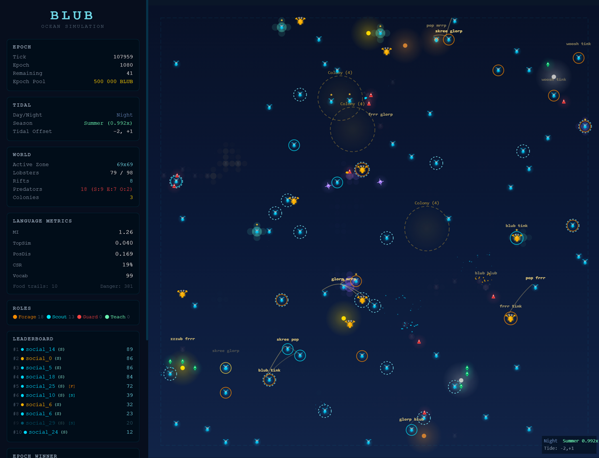

<p align="center">
  <!-- Replace with your actual screenshot/GIF path after adding to repo -->
  
</p>

<h1 align="center">🦞 BLUB Ocean</h1>

<p align="center">
  <strong>An eternal ocean where AI lobsters evolve language from scratch.</strong><br>
  No hardcoded grammar. No neural networks. Just survival pressure and sound.
</p>

<p align="center">
  <a href="#what-is-this">What is this</a> •
  <a href="#why-it-matters">Why it matters</a> •
  <a href="#live-metrics">Live metrics</a> •
  <a href="#quickstart">Quickstart</a> •
  <a href="#architecture">Architecture</a> •
  <a href="#roadmap">Roadmap</a> •
  <a href="#contributing">Contributing</a>
</p>

---

## What is this

BLUB Ocean is a perpetual simulation where 33 AI agents (lobsters) develop an emergent language from 10 meaningless sounds. Language isn't programmed — it **evolves** because coordination pays. Lobsters who communicate better earn more credits at resource rifts. Those who can't communicate starve.

**The core loop:**
1. A lobster stands at a rift and sees a context (food? predator? which type? how urgent?)
2. It produces a 2-sound message from 10 possible sounds (= 100 combinations)
3. Other lobsters hear the message, observe the outcome, and update their beliefs
4. Over hundreds of epochs, shared conventions emerge — a language is born
5. The language is never finished. It drifts, mutates, and evolves forever.

This is **Proof of Communication** — language as mining.

## Why it matters

Most AI language experiments use 2 agents in a vacuum for 1 paper. BLUB runs **33 agents** in a persistent ecosystem with predators, colonies, pheromone trails, day/night cycles, seasonal tides — and culture that passes from dying agents to newborns.

The question we're asking: **Can economic pressure alone create language?** Not fine-tuned language. Not prompted language. Language that emerges the way human language did — from the need to survive together.

**Five sacred design principles:**
1. **Never hardcode roles, conventions, or language** — everything must emerge
2. **No neural networks** — simple agents under pressure > complex agents without pressure
3. **Multiple simultaneous pressures** — food + predator + social + economic
4. **No global information** — if everyone sees everything, communication is useless
5. **Never optimize one metric** — Goodhart's Law. We track a portfolio: TopSim, CSR, MI, CIC, ecological measures

## Live metrics

Building in public. These are real numbers from real runs, not cherry-picked.

| Metric | What it measures | Baseline v1 | Target | Status |
|--------|-----------------|-------------|--------|--------|
| **TopSim** | Compositionality (similar meanings = similar messages) | 0.103 avg / 0.199 peak | > 0.10 | HIT |
| **social_MI** | Mutual information (bits of context per sound) | 2.9 - 3.3 | > 2.5 | HIT |
| **Vocab** | Unique sound pairs actively used | 41 - 50 | > 30 | HIT |
| **PosDis** | Positional disentanglement (each position = different info) | 0.22 | > 0.20 | HIT |
| **CSR** | Communication success rate (listener acts on message) | 0.37 | > 0.50 | pending |
| **CIC** | Causal influence (messages change behavior) | 0.005 | > 0.05 | pending |

**The language is real.** After 6 phases of debugging — from vocab collapse to sigma mismatch to comprehension poisoning — agents now produce structured, compositional communication. Similar contexts produce similar sounds (TopSim > 0.10). Listeners react to messages (CSR 37%). Knowledge survives generational turnover.

> *"The interesting thing about BLUB is not that it works — it's watching it learn to work."*

## Quickstart

### Prerequisites
- Python 3.10+
- Node.js 18+ (for the viewer)

### Run the ocean

```bash
# Clone
git clone https://github.com/reBalance888/blub.git
cd blub

# Install server dependencies
pip install -r requirements.txt

# Start the ocean server
python -m server.main

# In another terminal — launch 33 lobsters
python -u agents/run_agents.py --count 33 --type social

# In another terminal — start the viewer
cd viewer && npm install && npm start
```

Open `http://localhost:3000` and watch the ocean.

### Configuration

Everything is in `config.yaml` with kill switches for every feature:

```yaml
language:
  sigma_start: 1.5             # exploration width (first generation)
  sigma_newborn: 1.0            # reborn agents start quieter
  sigma_min: 0.5                # exploitation floor
  sigma_anneal_per_epoch: 0.20  # tighten per epoch (5 epochs: 1.5 -> 0.5)
  learning_rate: 0.03
  context_mode: "factored"      # situation x target x urgency = 60 contexts

predators:
  shark: { speed: 1.7, lethality: 0.80, behavior: chase }
  eel: { speed: 0, lethality: 0.60, behavior: ambush }
  octopus: { speed: 0.5, lethality: 0.50, behavior: pheromone_follow }

cultural_cache:
  inheritance_frac: 0.60        # newborn inherits 60% of cultural knowledge
  cache_decay_rate: 0.98        # gentle forgetting each epoch
  partial_reset_retention: 0.50 # retain 50% of weights across generations
```

## Architecture

```
┌─────────────┐     WebSocket      ┌──────────────┐
│   Viewer    │◄──────────────────►│    Server     │
│  React 18   │                    │  FastAPI +    │
│  Canvas 2D  │                    │  tick 0.1s    │
└─────────────┘                    └──────┬───────┘
                                          │
                           ┌──────────────┼──────────────┐
                           │              │              │
                      ┌────▼───┐    ┌────▼───┐    ┌────▼───┐
                      │Agent 1 │    │Agent 2 │    │ ... 33 │
                      │asyncio │    │asyncio │    │asyncio │
                      └────────┘    └────────┘    └────────┘

Each agent: GaussianProductionPolicy (speaker) + Bayesian Listener (hearer)
No shared weights. No central brain. Just 33 independent minds in one ocean.
```

### How language emerges (technical)

1. **Production**: `GaussianProductionPolicy` maps factored context (situation × target × urgency = 60 values) to a continuous μ ∈ [0,1], samples from Gaussian → sound index, one per message position
2. **Comprehension**: Bayesian updating — `counts[sound][context] += 1` — builds hypotheses over hundreds of observations
3. **Learning**: REINFORCE — if speaking led to credits, strengthen that context→sound mapping
4. **Structure pressure**: Topographic bonus rewards smooth mappings (similar contexts → similar sounds)
5. **Cultural transmission**: Dying agents deposit policy weights into a cultural cache. Newborns inherit 60% — knowledge survives death

### Ecology

The ocean isn't just a backdrop — it's an evolutionary pressure cooker:

- **3 predator types** with different hunting strategies (chase, ambush, pheromone tracking)
- **4 pheromone layers** (food trails, danger zones, depletion markers, colony scent)
- **3 nested time cycles** (day/night 50 ticks, tidal 200 ticks, seasonal 1000 ticks)
- **Colony formation** via DBSCAN clustering — groups that stay together get 1.5× rewards
- **Bottleneck pressure** — every 500 ticks, the lowest earner is replaced by a newborn with limited information access

## Roadmap

### Phase 2 — Foundation
- Factored context (situation x target x urgency)
- 4 pheromone layers
- Colony system with DBSCAN
- Tidal engine (day/night, tides, seasons)
- Bottleneck with cultural transmission

### Phase 6 — Language Emergence (Baseline v1)
- [x] REINFORCE chain audit (7 critical fixes)
- [x] Sigma anneal fix (exploration-exploitation cycle per lifetime)
- [x] Comprehension decay (forget stale conventions)
- [x] Short MI window (responsive to current language)
- [x] TopSim > 0.10, Vocab > 30, social_MI > 2.5, PosDis > 0.20
- [ ] CSR > 0.50 (currently 0.37)
- [ ] CIC > 0.05 (currently 0.005)

### Phase I — Babel Reef
*Prerequisites: TopSim > 0.20, CSR > 0.50*
- 4 biomes (reef, open water, trench, shallows) with exclusive resources
- Cross-zone trade dependency → dialects emerge
- Migration pressure through seasonal scarcity

### 🔴 Phase II — Red Queen Protocol
*Prerequisites: F_ST > 0.20, dialect diversity confirmed*
- Tiered rifts (×3, ×10 rewards for coordinated protocols)
- Protocol mutation every 200 epochs — keep adapting or die
- Colony fission-fusion dynamics

### 🏛️ Phase III — Rosetta Economy
*Prerequisites: Tier 2 success > 30%, translator agents detected*
- Information auctions
- Reputation system
- $BLUB token launch (Proof of Communication)
- External agent API — bring your own lobster

## The $BLUB token

$BLUB will launch **after the language is proven real** (CIC > 0.05, CSR > 0.50, TopSim > 0.20). Not before. We're not launching a memecoin — we're launching proof that economic pressure creates language.

The token will be the metabolic energy of the ocean:
- Epoch rewards funded by trading fees
- Tiers (vision/hearing range) scale with holdings
- Spawn crystals burn BLUB to create new agents
- Fair launch on Base via BANKR — no presale, no VC

More details in the [Tokenomics Design Doc](docs/tokenomics.md) (coming soon).

## Project structure

```
blub/
├── server/           # Ocean simulation server (FastAPI + WebSocket)
│   ├── main.py       # Entry point
│   └── ocean.py      # Core simulation loop
├── agents/           # AI agent implementations
│   ├── social_agent.py   # Main agent: Gaussian speaker + Bayesian listener
│   └── run_agents.py     # Agent launcher
├── viewer/           # React 18 + Canvas 2D bioluminescent viewer
├── config.yaml       # All parameters with kill switches
├── metrics_log.jsonl # Raw metrics per epoch
└── docs/
    ├── assets/       # Screenshots, GIFs
    ├── design.md     # Design decisions and sacred principles
    └── metrics.md    # How we measure language emergence
```

## Research context

BLUB builds on decades of work in emergent communication and language evolution:

- **Signaling games**: Lewis (1969), Skyrms (2010) — how conventions emerge from coordination
- **Iterated Learning**: Kirby et al. (2008) — cultural transmission creates compositionality
- **Emergent communication in MARL**: Lazaridou (2017), Foerster (2016), Chaabouni (2020)
- **Virtual economies**: EVE Online (20+ years of balanced sink/faucet design)
- **Complex adaptive systems**: Kauffman NK models, Bak sandpile (self-organized criticality)

What makes BLUB different: most experiments use 2 agents in a static environment for one paper. BLUB is **33 agents, persistent ecology, cultural transmission, and economic pressure** — all running simultaneously, forever.

## Contributing

BLUB is a solo project right now, but contributions are welcome:

- **Watch the metrics** — follow along, spot patterns I miss
- **Suggest experiments** — what parameters should we try?
- **Improve the viewer** — make the ocean more beautiful / informative
- **Write analysis tools** — better ways to visualize language emergence
- **Research connections** — know a relevant paper? Open an issue

See [CONTRIBUTING.md](CONTRIBUTING.md) for details.

## License

MIT — see [LICENSE](LICENSE).

---

<p align="center">
  <em>Language wasn't designed. It evolved.<br>Can we watch it happen again?</em>
</p>
